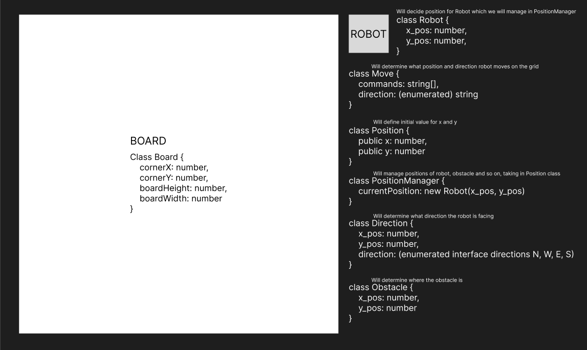
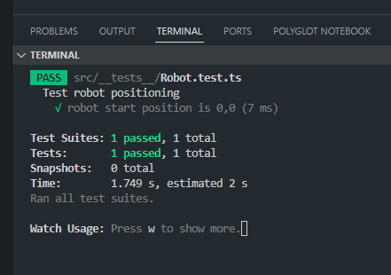
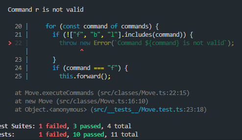
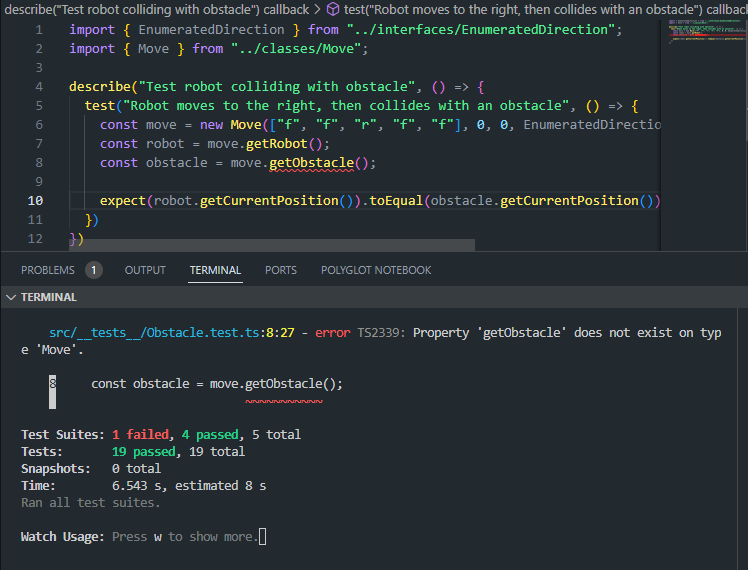

## Robot Challenge

`Company: NetConsult`

`Language: TypeScript`

`Start time: 12:44 - 2024-03-12`

To init my project follow these steps after cloning from github

```
cd api
npm i
npm run test
```

- Develop an api that moves a robot around on a grid (flat surface with defined size)
- Grid position (0, 0) should be the upper left corner
- You are given the initial starting point (x,y) of a robot and the direction (N,S,E,W) it is facing.
- The robot receives an array of commands.
- Implement commands that move the robot forward/backward (f,b).
- Implement commands that turn the robot left/right (l,r).
- "If a given sequence of commands encounters an obstacle or is out of bounds, the robot should stop and report the obstacle. For example if it hits an obstacle or wall it should stop immediately without executing any more commands.
- Implement detection if the new position is inside the bounds before moving to the new position.
- Implement obstacle detection before each move to a new square.

Test Cases

- The robot is on a 100×100 grid at location (0, 0) and facing SOUTH. The robot is given the commands "fflff" and should end up at (2, 2)
- The robot is on a 50×50 grid at location (1, 1) and facing NORTH. The robot is given the commands "fflff" and should end up at (1, 0)

  - this will not work, since it will meet the 0,0 corner once the movement is done. this test will fail.

- The robot is on a 100×100 grid at location (50, 50) and facing NORTH. The robot is given the commands "fflffrbb" but there is an obstacle at (48, 50) and should end up at (48, 49)

Bonus

- Ability to implement different rule sets for flat surface or a globe where you warp when you get out of bounds

Hints: use multiple classes, TDD and a healthy approach to VCS

---



### Interpretation

My interpretation of the assignment is that I am supposed to create an api with a grid for a new robot to move around on. My thoughts about it was, do I need to build an entire REST api or is it just a simple api with actions and tests? So I will build an api with classes that can move around a robot, test cases and certain rules.

Created a git repository and added my first init.
Created my .gitignore with some basic values, which I will add to if needed.

Map structure

```
project-root/
|-- api/
|   |-- src/
|   |   |-- classes/
|   |   |   |-- Board.ts
|   |   |   |-- Position.ts
|   |   |   |-- Robot.ts
|   |   |-- __tests__/
|   |   |   |-- Robot.test.ts
|   |   |-- interfaces
|-- build/
|-- node_modules/
|-- tsconfig.json
|-- ts-lint.json
|-- jest.config.json
|-- package.json
|-- .gitignore
|-- README.md
```

```
npm init -y
npm i jest @types/jest ts-node typescript ts-jest
tsc --init
```

I created jest.config.ts and tslint.json with configuration.

I created my first test to check the starting position for the robot, making sure it is correct at x: 0 and y: 0.
I built the test which failed, I then created the class to set the values for the robot, and the test passes.



I had already written some code to make the robot move to the left, right, up, and down, but for TDD purposes, I removed that code and ran the tests first. Which, of course, failed. I added the code again, and this time the test passed.


---

Next, I want to test the direction of the Robot. I tested if the robot is facing north, as expected the test failed, since I have no code for this.

```
describe("Test robot directions N, W, E, S", () => {
  test("Robot direction is North", () => {
    const direction = new Direction(0, 0, EnumeratedDirection.north);
    const currentDirection = direction.getCurrentPosition();
    expect(currentDirection).toEqual(EnumeratedDirection.north);
  });
});
```

So now I want to test the Board, to see if I can set the grid to the expected size. First, I want to test that the grid size is 100x100.
The test fails, since I have no code built for this.
I create the board where I want to set the starting position and size of the grid. My board will take in 4 values, starting position x, y, grid-width, and grid-height.
Once this is done, the test runs without error.

```
describe("Test grid pattern and positioning", () => {
  test("Grid pattern is 100x100", () => {
    const board = new Board(0, 0, 100, 100);
    expect(board.getWidth()).toEqual(100);
    expect(board.getHeight()).toEqual(100);
  });
});
```

After I ran the test to check for the right turn, it seemed to pass even though I hadn't created that method yet. So I created an error to occur if the command was not valid. After this, the test failed, of course. I then created the method and added the command to the allowed commands.



So now I want to test if my robot stays within the grid when moving out of bounds.
This happens,


I am testing that the robot will land on the 0,0 position when giving commands: ["f", "f", "b", "b", "b"] but it instead goes out of bounds.
I inverted the grid to increase going downwards as well, with incrementing steps instead of decrementing.

Continuing on to create an obstacle test to see if the robot will land on the obstacle, then test if it stops before the obstacle.



So I ran into some issues and got kinda stuck in just coding so I lost some documentation to that. I will however shortly down here tell you a little about each class I've used. First of all I want to mention I have never used classes in an API so I had to take some time to learn and implement.

### Position.ts

The position is easy, it takes in an x and a y value, then returns it.

### PositionManager.ts

PositionManager uses the value from Position to create a managing system for each different items that needs a position like Robot and Obstacle.
It also handles the movements up, down, right, left

### Obstacle.ts

The Obstacle makes use of PositionManager that we later use inside the Move class.

### Robot.ts

Same as Obstacle, it takes in the PositionManager as well as the EnumeratedDirection which I created in my utils/interface-folder.
I also created some methods to decide currentPosition and currentDirection.

### Direction.ts

Direction takes in the robot position and the direction and passes it to where I want to use it.

### Board.ts

Board is created with width and height, and also the obstacle. So when we set a board we also set an obstacle.

### Move.ts

This was the most challenging class to create. Here I wanted to use almost everything I had built, I wanted to use this class to get all positions and to set the desired settings. I created a method to determine what command was to be executed to go forward, backwards or left and right, I also determined this so the Robot would execute depending on what direction it was facing.

### RobotController.ts

I tried to create an easy api call to test the Robot route, I am testing the initial position and direction of the Robot. As well as invalid values.

### Testing

I created alot of tests before creating the code to make sure it would work correctly. I made sure to test every possible outcome and all classes except for Position.

### Evaluation

When I first got the assignment I didn't really know where to start. But then I started breaking it down into smaller pieces, like what classes do I wanna use? What kind of tests do I want to write.
So I started there and slowly coded my way forward.

I have never used classes in JavaScript or TypeScript so it was a little bit of a challenge but I had alot of fun with it.

I tried a few different ways to build the project, but I changed the code and reformatted a few times to make it more readable and clean.
